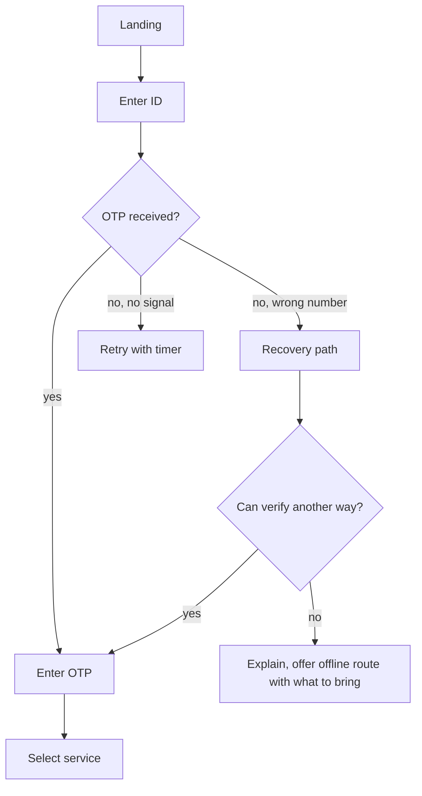

# Week 2 — Build

**Sprint 1 · Week 2 of 4 · Theme: forms, error messages, and the whole flow at mid fidelity**

---

## By Friday you can

- Draw a complete flow including every failure path, not just the happy one
- Design a form where every field has a label, a hint, and a stated validation rule
- Write an error message that says what happened, why, and what to do next
- Contribute a documented component to a shared design system

## The week at a glance

| Day | LEARN | DO |
|---|---|---|
| **Mon** | Form Design Patterns ch. 1 "A Registration Form" | P2.1 P2.2 — flow diagram, the no-OTP path |
| **Tue** | Form Design Patterns ch. 2 "A Checkout Form" | P2.3 C3.1 — form structure decision, happy path |
| **Wed** | Form Design Patterns ch. 3 · NNGroup on error messages | C3.2 C3.3 — document guidance, address entry |
| **Thu** | NNGroup "Error Message Guidelines" · Polaris content guidance | C4.1 C4.2 — error inventory and messages · **critique** |
| **Fri** | Figma Learn: Variants, Properties | C3.4 C4.3 C4.4 — upload states, confirmation, plain language |
| **Sat** | — | S2 component contribution · F2 why session and teardown |

---

# Monday

## LEARN — 90 minutes

| Source | What exactly | Time |
|---|---|---|
| **Form Design Patterns**, Adam Silver | Ch. 1 "A Registration Form" — labels, placeholders, floating labels, validation timing | 50 min |
| **mermaid.live** | The flowchart syntax page. You need `graph TD`, nodes, and labelled arrows. Nothing else. | 20 min |
| **Your own R1.2** | Re-read your heuristic audit from last week | 20 min |

**What to take from ch. 1:** a placeholder is not a label, because it disappears exactly when the user needs it. Labels go above the field on mobile. Validate on submit, not on every keystroke, unless the field has a format the user cannot guess.

→ **Commit** `students/UX{n}/week2/day1-learning.md`

## DO — 90 minutes

### P2.1 — Draw the full flow

**Learn first:** the Mermaid flowchart syntax from this morning.

**Method**
1. Start with the happy path: every screen from login to confirmation.
2. Add every decision point as a diamond. "Is the document in your name?" is a decision point even if the current service never asks it.
3. Add every exit. Where does a user leave, on purpose or by failure?
4. Add the three failure paths from `01-project-brief.md` section 4 — one for each user.
5. Use Mermaid so it lives in git and can be reviewed as a diff.

**Worked example** — a fragment for a different service:

Note that the "no" branches are not dead ends and not one generic error. Each one has its own path.

**Done when**
- [ ] Every screen from your R1.1 screenshots is in the diagram
- [ ] Every decision point is a diamond with a question in it
- [ ] All three brief user failure paths are drawn
- [ ] No branch ends at an unlabelled error
- [ ] It renders correctly on GitHub

→ `students/UX{n}/week2/P2-1-flow.md`

### P2.2 — The no-OTP path

The hardest problem in this brief. Lakshmi, 67, cannot receive the OTP because the registered mobile is a number she no longer has.

**Method**
1. Write down what the interface currently does. (It fails silently, which is the finding.)
2. List everything the interface *could* do before giving up: explain what is happening, state clearly that the number cannot be changed here, tell her exactly what document and what process changes a registered mobile, tell her what it costs and how long it takes, let her save her progress, give her a checklist she can take with her.
3. Design the path.
4. **It cannot end in "visit a centre" without first exhausting everything the interface can do.** "Visit a centre" as the first response is the current design, and it is why she is at the counter.

**Done when**
- [ ] Names what the current service does and why it fails
- [ ] Lists at least four things the interface can do before escalating
- [ ] Designs the actual screens or states, not a description
- [ ] If it ends at an offline route, the user leaves with a specific list of what to bring and where
- [ ] Nothing in it requires her to already understand the system

→ `students/UX{n}/week2/P2-2-no-otp-path.md`

---

# Tuesday

## LEARN — 90 minutes

| Source | What exactly | Time |
|---|---|---|
| **Form Design Patterns** | Ch. 2 "A Checkout Form" — one thing per page versus long forms, field grouping, address entry specifically | 50 min |
| **GOV.UK Design System** | The "Text input" and "Address" pattern pages. Free, and the best public reference for government forms. | 25 min |
| **Refactoring UI** | The section on visual grouping | 15 min |

**What to take:** one-thing-per-page reduces cognitive load and makes error recovery cheap, but it adds page loads, which on a 3G connection is a real cost. That is the tradeoff you have to state in P2.3, not resolve by preference.

→ **Commit** `day2-learning.md`

## DO — 2 hours

### P2.3 — Form structure decision

**Learn first:** Form Design Patterns ch. 2 on one-thing-per-page. GOV.UK's address pattern.

**Method**
1. Write out **Option A**: address entry as one page with all nine fields.
2. Write out **Option B**: address entry split across multiple steps.
3. For each, list what is better and what is worse. Consider: cognitive load, error recovery, number of page loads on a slow connection, whether the user can see what they have already typed, session expiry risk.
4. Decide.
5. **Cite something.** Your reason must reference one of: a documented convention (GOV.UK, Material, Polaris), a named heuristic, or your own R1.5 observation.

**Worked example** — the shape of a valid decision:

> **Decision:** One page, with the nine fields grouped into three labelled sections.
>
> **Why:** On a connection that drops (brief section 4, Ramesh), each additional page load is a failure point. GOV.UK splits address entry only when validation between steps is needed, which is not the case here. Grouping into three sections addresses the cognitive load objection without adding page loads.
>
> **What is worse because of this:** An error at the bottom of a long form is easy to miss. Mitigated with an error summary at the top that links to each failed field, which is the GOV.UK error summary pattern.
>
> **What would change my mind:** If testing shows users abandon before reaching the bottom, splitting becomes correct.

**Done when**
- [ ] Both options written out fully, not one option and a dismissal
- [ ] At least four tradeoff dimensions considered
- [ ] A clear decision
- [ ] A named citation, not an opinion
- [ ] What is worse because of your choice, stated
- [ ] What would change your mind

→ `students/UX{n}/week2/P2-3-form-structure-decision.md`

### C3.1 — The happy path at mid fidelity

**Learn first:** everything from week 1. This is where your scales get used.

**Method**
1. Build every screen on the happy path at 390px width.
2. Use only your tokens from week 1. No new sizes, no new colours, no new spacing values. If you need one, that is a system finding — write it down.
3. **Real content only.** Real field labels, real button text, real help text. No lorem ipsum. No "John Doe". If you do not know what a label should say, that is the design problem, and filling it with a placeholder hides it from you.
4. Mid fidelity means: real type, real spacing, real content, greyscale plus your semantic colours only. No shadows, no illustrations, no polish.

**Grey boxes are not mid fidelity.** A grey box means you have not decided anything.

**Done when**
- [ ] Every happy path screen from P2.1
- [ ] 390px width
- [ ] Only week 1 tokens used, with any exceptions logged as system findings
- [ ] Zero placeholder text anywhere
- [ ] Every button has its real label
- [ ] Figma link plus exported PNGs

→ `students/UX{n}/week2/C3-1-happy-path-mobile.md`

---

# Wednesday

## LEARN — 90 minutes

| Source | What exactly | Time |
|---|---|---|
| **Form Design Patterns** | Ch. 3 "A Flight Booking Form" — the parts on progressive disclosure and helping users choose | 40 min |
| **NNGroup** | "Error Message Guidelines" and "Placeholders in Form Fields Are Harmful" | 25 min |
| **Shopify Polaris** | The "Help text" and "Inline error" content guidance pages | 25 min |

**What to take:** guidance must arrive before the decision, not after the mistake. If a rule only appears in an error message, the design has chosen to let the user fail first.

→ **Commit** `day3-learning.md`

## DO — 2 hours

### C3.2 — Document guidance

Ramesh does not know that the proof of address must be in his own name. He has the electricity bill, and it is in his father's name. The current service shows him 40 accepted document types and no rule.

**Method**
1. Find the moment in your flow where he chooses a document.
2. Decide where the rule "it must be in your name" has to appear so it arrives *before* he uploads. Options: on the selection screen, as an inline confirmation, as a checklist, as a single question.
3. Design it.
4. Write down how you chose that position. The reason is about when the user forms an intention, not about layout.
5. Do not solve this with a 40-item list plus a paragraph of text. That is what exists now.

**Worked example** — the reasoning shape, for a different service:

> The rule appears as a single yes/no question before the file picker opens: "Is the document in your own name?" A "no" answer does not block; it explains the two options and what each costs, which keeps the user in the flow instead of failing them at submission. The rule appears here because this is the first moment the user has formed an intention about a specific document, which is the last moment guidance can change their behaviour without wasting their effort.

**Done when**
- [ ] Guidance appears before the upload, not after
- [ ] The chosen moment is justified in terms of when the user decides
- [ ] "No" is handled with options, not just a block
- [ ] Not solved with a wall of 40 document types

→ `students/UX{n}/week2/C3-2-document-guidance.md`

### C3.3 — Address entry

**Learn first:** GOV.UK's address pattern from Tuesday, and your P2.3 decision.

**Method**
1. **Before you open Figma**, write the field table. Every field: label, whether it is required, an example, and the validation rule you can actually state.
2. Only then design the screen.
3. Any field where you cannot write a real validation rule is a field you do not understand yet. Find out or drop it.

**Worked example** — three rows:

| Field | Label | Required | Example | Validation rule |
|---|---|---|---|---|
| PIN | PIN code | Yes | 560001 | Exactly 6 digits. First digit 1–8. Must match a real postal PIN, checked against the postal API. |
| Landmark | Landmark (optional) | No | Near Ganesh temple | Free text, max 60 characters. No validation. Marked optional in the label, not only with an asterisk. |
| House | House or building number | Yes | 14/A, 2nd floor | Free text, max 80 characters. Cannot be only whitespace. |

**Done when**
- [ ] Field table written before the design
- [ ] Every field has a label, required status, an example, and a stated rule
- [ ] Optional fields say "optional" in the label
- [ ] Every rule is something you could hand to an engineer
- [ ] Screen designed at 390px, matching your P2.3 decision
- [ ] Error summary pattern included if you chose a long form

→ `students/UX{n}/week2/C3-3-address-entry.md`

---

# Thursday

## LEARN — 75 minutes

| Source | What exactly | Time |
|---|---|---|
| **NNGroup** | "Error Message Guidelines" again, this time with your own error list open | 20 min |
| **Shopify Polaris** | "Error messages" content guidance in full | 20 min |
| **GOV.UK** | "Error message" component page, including the wording examples | 20 min |
| **Your R1.2** | Every finding you rated 3 or 4 | 15 min |

**The rule you are learning:** an error message has three jobs — say what happened, say why, say what to do next. Most shipped error messages do one. Some do none.

→ **Commit** `day4-learning.md`

## DO — 2 hours (plus critique)

### C4.1 — Error inventory

**Method**
1. Go through your flow screen by screen and list every way it can fail.
2. Sources: the live service's real errors (R1.1), your constraint list (P1.3), your validation rules (C3.3), and the network itself.
3. Categories to cover: authentication, validation, file upload, network, session, server, business rule, permission.
4. Minimum 15. If you have fewer, you have not thought about the network or about session expiry.

**Done when**
- [ ] 15 or more distinct failures
- [ ] Each tagged with a category
- [ ] Each names which screen it happens on
- [ ] Network failures and session expiry are included

→ `students/UX{n}/week2/C4-1-error-inventory.md`

### C4.2 — Write every error message

**Learn first:** the three jobs of an error message, from this morning.

**Method**
1. For every error in C4.1, write the message.
2. Each must answer: what happened · why · what to do next.
3. No error code as the primary message. A code can appear as small secondary text for support, never as the headline.
4. **No "something went wrong" anywhere.** If you genuinely do not know what went wrong, say what the user can do and what you will do.
5. State where the message appears: inline under the field, in a summary at the top, as a full-page state, or as a toast. The position is part of the message.

**Worked example**

| Error | ❌ Current | ✅ Yours | Where |
|---|---|---|---|
| File too large | "Upload failed" | "This file is 4.2MB. The limit is 2MB. Most phone photos are too large — take a new photo using the 'Scan document' option, which compresses it automatically." | Inline, under the upload field |
| Wrong OTP, 2 attempts left | "Invalid OTP" | "That code did not match. You have 2 attempts left before you need to request a new code. Codes expire after 10 minutes." | Inline, under the OTP field |
| Session expired | (silent, redirects to login) | "You were signed out after 15 minutes of inactivity. Your address details were saved. Sign in again and you will return to where you stopped." | Full page, before the login form |

Note that each one gives a number, a cause, and a next action.

**Done when**
- [ ] Every error from C4.1 has a message
- [ ] Every message does all three jobs
- [ ] Zero error codes as headlines
- [ ] Zero instances of "something went wrong"
- [ ] Position stated for each
- [ ] Where you state a limit, you state the actual number

→ `students/UX{n}/week2/C4-2-error-messages.md`

### Thursday critique — 90 minutes

Present: your happy path, your address entry field table, and three error messages. 12 minutes. Run against `07-critique-guide.md`.

---

# Friday

## LEARN — 60 minutes

| Source | What exactly | Time |
|---|---|---|
| **Figma Learn** | "Variants" and "Component properties" lessons | 35 min |
| **Polaris or Carbon** | One component's documentation page, read as a model for how much detail is needed | 25 min |

→ **Commit** `day5-learning.md`

## DO — 2 hours

### C3.4 — Upload states

**Method**
Design five distinct states, not one screen with an error variant swapped in:

1. **Empty / ready** — before anything is chosen. Must state the accepted formats and the size limit here, not in the error.
2. **File too large** — with the actual size and the actual limit, and a path forward.
3. **Wrong format** — with what was given and what is accepted.
4. **Interrupted at 60% on a bad connection** — what happens to the partial upload, whether it resumes, what the user should do.
5. **Success** — what was uploaded, a thumbnail or filename, and how to replace it.

For state 4, decide and state: does the upload resume, restart, or is the partial data discarded? The answer changes what you promise the user.

**Done when**
- [ ] Five separate designed states
- [ ] Limits and formats stated in the empty state, before failure
- [ ] The interrupted state says explicitly what happens to the partial upload
- [ ] Success shows what was uploaded and how to change it
- [ ] Figma link

→ `students/UX{n}/week2/C3-4-upload-states.md`

### C4.3 — Confirmation copy

The citizen has paid ₹50 and will wait up to 30 days. The current service shows a URN once and it is easy to lose.

**Method**
Write the copy. It must answer, in this order:
1. What just happened, and that it worked
2. The URN, presented so it cannot be lost — and state your mechanism: SMS, email, downloadable receipt, or all three
3. What happens next, and roughly when
4. How they will be told
5. What to do if nothing happens by a stated date
6. Whether the ₹50 is refundable if rejected

**Done when**
- [ ] All six answered
- [ ] The URN preservation mechanism is specific, not "we will show it clearly"
- [ ] A real date or day count, not "soon"
- [ ] The refund question is answered, even if the answer is no

→ `students/UX{n}/week2/C4-3-confirmation-copy.md`

### C4.4 — Plain language pass

**Method**
1. Take three of your messages from C4.2 or C4.3.
2. Rewrite each for a reader who is slow in English. Shorter words. Shorter sentences. One idea per sentence. Same information — you are not allowed to remove content to make it simpler.
3. Note what you could not simplify and why. Some things, like a legal requirement or a document name, cannot be reworded.

**Done when**
- [ ] Three before-and-after pairs
- [ ] No information lost in any rewrite
- [ ] What you could not simplify is named, with the reason

→ `students/UX{n}/week2/C4-4-plain-language.md`

---

# Saturday

## S2 — First components, 90 minutes

### S2.1 — Contribute one component
The system owner assigns each designer one of: **button · text input · select · file upload**. So all four get built.

Your contribution must document:
- Every state: default, hover, focus, active, disabled, error, loading where it applies
- Every variant, and why each exists
- Keyboard behaviour: where focus goes, what Tab does, what Escape does
- Screen reader behaviour: what is announced
- Which semantic HTML element it maps to, and one sentence on why that element and not a `div` with a click handler
- Usage guidance: one "do" and one "do not"

→ `system/components/{component}.md` plus the Figma component in the shared library

### S2.2 — Review one peer's component
Your review must name **one thing that will break when someone else uses it**. Examples of a real review comment: "there is no defined behaviour when the label wraps to two lines", "the disabled state fails 3:1 contrast so it is invisible in sunlight", "focus is styled with `outline: none` and replaced by a shadow, which disappears in high contrast mode".

"Looks good" is not a review and is logged as a rubber stamp.

→ pull request comment, logged in `system/docs/review-log.md`

## F2 — Fundamentals

**F2.1 — Why session: visual hierarchy and whitespace.** The presenter takes one screen from a cohort member's own week 2 work and rebuilds its hierarchy live, narrating each change.
→ `fundamentals/why-sessions/week02-hierarchy.md`

**F2.2 — Teardown:** a state electricity board bill payment flow.
→ `fundamentals/teardowns/02-electricity-payment.md`

**F2.3 — Drill continues.** Same log file, one line a day.

---

## Friday checklist

- [ ] 5 learning summaries
- [ ] P2.1, P2.2, P2.3
- [ ] C3.1, C3.2, C3.3, C3.4
- [ ] C4.1, C4.2, C4.3, C4.4
- [ ] S2.1 component contributed, S2.2 peer review given
- [ ] Critique attended

**If short on time, cut C4.4 first, then C3.4 down to three states.** Never cut C4.2. Every screen you design in week 3 depends on the error messages existing.

Next: `04-week3.md`
