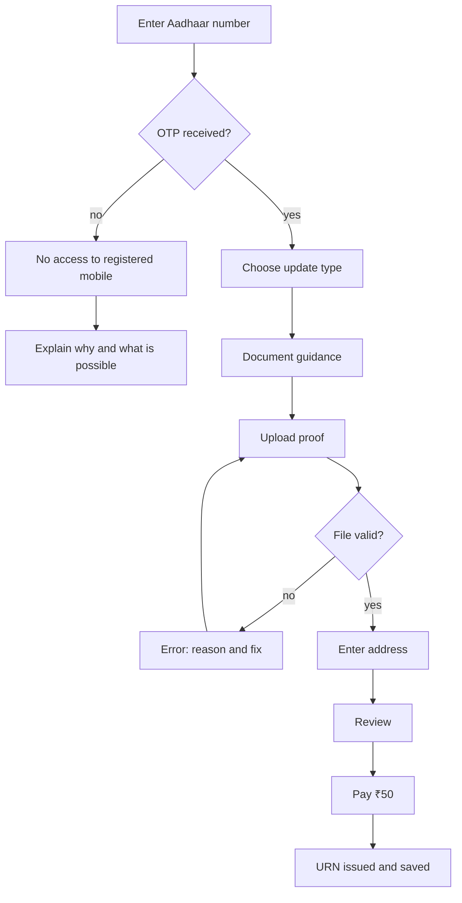

# Tools Setup, Sprint 1

Two new tools this sprint. Everything else waits. Full tool map and adjacent tools in `../../Learning Resources.md`.

---

## 1. Required before week 1

### Figma
Free Education or Starter plan. One shared team, three file types.

| File | Who edits | Naming |
|---|---|---|
| `SPRINT-1 System` | System owner of the week only | one file, library published |
| `SPRINT-1 Practice UX{n}` | You only | one per designer |
| `SPRINT-1 Delivery` | System owner and core admin | one file |

Learn this sprint, nothing more: auto layout, components, component properties and variants, variables and modes, published libraries, branching. Skip plugins beyond the two listed below until week 3.

Plugins to install: **Stark** (contrast and focus order), **Tokens Studio** (installed now, used in Sprint 4).

### Accessibility tooling
- **axe DevTools** browser extension
- **VoiceOver** on macOS, Cmd plus F5. Learn 4 commands: start, next item, next heading, read from here.
- **NVDA** on Windows if you are not on a Mac.

Run VoiceOver on any website once in week 1. Doing it for the first time in week 4 under gate pressure goes badly.

### Colour
**Leonardo**, leonardocolor.io, free. Used for the C2 ramps. Reason it is assigned over picking swatches by eye: a hand picked ramp has uneven perceptual steps, which shows up as a component that looks correct at one step and muddy at another.

### Git and editor
- **VS Code** with the Markdown Preview and a Mermaid preview extension
- **git** installed, identity configured, upstream remote added
- **GitHub** account with the same email as your git config

### Screen recording
Whatever your OS provides. Needed for the keyboard pass evidence in the accessibility gate.

---

## 2. File and frame conventions

Conventions exist so a reviewer can find a frame from a link without asking.

### Figma page structure, practice file
```
Page: 00 Cover                     one frame, your name code and the sprint
Page: 01 Audit                     screenshots of the live service, annotated
Page: 02 Foundations               type scale, spacing, colour ramps
Page: 03 Flow                      the flow at mid fidelity
Page: 04 States                    every screen, every state, grouped by screen
Page: 05 Final                     high fidelity, 390 and 1440
Page: 99 Rejected                  everything you tried and dropped, kept on purpose
```

Page 99 is not optional. The rejected options are what you present in critique and at the defense.

### Frame naming
```
{screen number}-{screen name}-{state}
03-upload-default
03-upload-error-filesize
03-upload-loading-15s
```

State suffixes, use exactly these: `default`, `firstrun`, `empty`, `loading`, `partial`, `success`, `error-{reason}`, `offline`, `permission`, `zero`, `ratelimit`, `confirm`, `expired`.

### Commit file naming
```
{TASK-ID}-{short-name}.md
C1-1-type-scale.md
R1-2-heuristic-audit.md
```

Lowercase, hyphens, no spaces, no version numbers in the filename. Git holds versions.

---

## 3. Tokens

Written by hand this sprint. Tokens Studio automation comes in Sprint 4, so doing it manually first means you understand what the tool is doing.

`system/tokens/primitive.json`
```json
{
  "color": {
    "neutral": { "50": { "value": "#f8f9fa" }, "900": { "value": "#0d1117" } },
    "blue":    { "500": { "value": "#0b5cd5" } }
  },
  "space":  { "1": { "value": "4px" }, "2": { "value": "8px" } },
  "font":   { "size": { "body": { "value": "16px" } } }
}
```

`system/tokens/semantic.json`
```json
{
  "color": {
    "text":        { "primary": { "value": "{color.neutral.900}" } },
    "surface":     { "default": { "value": "{color.neutral.50}" } },
    "interactive": { "default": { "value": "{color.blue.500}" } },
    "focus":       { "ring":    { "value": "{color.blue.500}" } }
  }
}
```

**The rule that matters.** A screen never references a primitive. Screens reference semantic tokens only. If a screen needs `color.blue.500` directly, the semantic layer is missing a role, and adding that role is the work.

---

## 4. Mermaid, for flows

Flows live in git as Mermaid so they can be reviewed as a diff. Figma flows are optional and secondary.

```markdown

```

Every exit and every failure edge must be drawn. A flow diagram with only the happy path is not a flow diagram.

---

## 5. Not this sprint

Do not set these up yet. Each has a sprint.

| Tool | Sprint |
|---|---|
| Maze or Lyssna, Optimal Workshop, Dovetail | 2 |
| FigJam, ProtoPie | 3 |
| Tokens Studio automation, Storybook, Style Dictionary | 4 |
| PostHog, Rive | 5 |
| Microsoft Clarity, portfolio host | 6 |

Photoshop, Illustrator, After Effects, Blender, Spline: not required for this program. See `../../Learning Resources.md` section 10 for when each is genuinely the right tool.

---

## 6. AI tools

Allowed. Disclosed on every file. Never the decision.

| Use | Allowed |
|---|---|
| Generating 10 microcopy variants to choose from | Yes, disclose, and the chosen one must be tested or defended |
| Summarising an article you then read | Yes |
| Explaining a WCAG criterion you then verify against the spec | Yes |
| Generating a whole screen | No |
| Producing a research finding | No |
| Writing your decision record | No |

Every committed file ends with the AI line. `AI use: none.` is a complete and acceptable answer.

---

## 7. Cost

Everything in Sprint 1 runs on free tiers. Figma Starter allows three files, which is exactly the three named above. If the cohort exceeds it, apply for Figma Education, which is free with a student email and takes a few days, so apply in week 1 rather than week 3.

Books are the only real cost. Buy order and what to borrow instead is in `../../Learning Resources.md` section 14.
