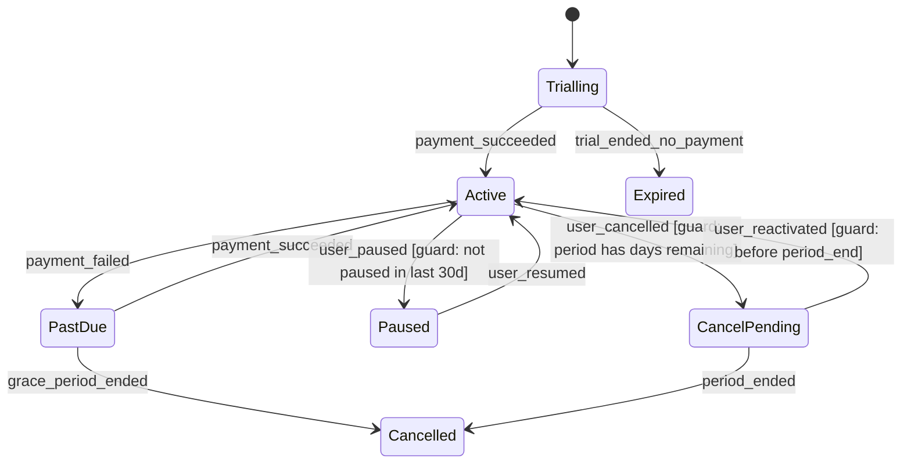

# Week 9 — Transitions

**Sprint 3 · Week 9 of 12 · Theme: state machines, feedback, and what happens between screens**

---

## By the end of this week you can

- Draw a state machine for a real system and name every transition and guard
- Specify feedback for every action based on its actual latency
- Design the states that exist between "before" and "after"
- Write microcopy for a state change that a user did not initiate

## The week at a glance

| Step | LEARN | DO |
|---|---|---|
| **1** | About Face on interaction and posture · state machine basics | I1.1 — subscription state machine |
| **2** | NNGroup response times · optimistic UI patterns | I1.2 I1.3 — latency plan, feedback design |
| **3** | About Face on undo and error tolerance | I1.4 — undo, confirm, and irreversibility |
| **4** | Polaris and Material on interaction states | I1.5 C10.1 — transition inventory, hi-fi states · **critique** |
| **5** | Microcopy references | C10.2 P9.1 — state-change copy, interaction principles |
| **6** | — | S11 system · F9 why session and teardown |

---

# the start of the week

## LEARN — 90 minutes

| Source | What exactly | Time |
|---|---|---|
| **About Face**, Cooper | The chapters on postures (sovereign, transient, daemonic) and on designing for intermediates | 45 min |
| **Statecharts / state machines** | statecharts.dev, the "what is a state machine" and "guards" pages | 30 min |
| **Your own cancelled subscription** | The screenshots you took before the sprint started | 15 min |

**What to take:** most interfaces are designed as a set of screens, and the bugs live in the transitions between them. A state machine forces you to name every state, every event, and every guard — and it makes the impossible states visible before they get built.

→ **Commit** `students/UX{n}/week9/session1-learning.md`

## DO — 2 hours

### I1.1 — Subscription state machine

**Method**
1. List every state a subscription can be in. Start with: trialling, active, past due, paused, cancelled pending end of period, cancelled, expired, reactivated.
2. For every state, list the events that can move it. Payment succeeded, payment failed, user paused, user cancelled, period ended, card expired, refund issued.
3. For every transition, write the **guard**: the condition that must be true for it to happen. "User can pause" is not a transition. "User can pause if the subscription is active and has not been paused in the last 30 days" is.
4. Find the impossible combinations and write them down. Can something be paused and past due at the same time? Decide, and say so.
5. Use Mermaid `stateDiagram-v2` so it lives in git.

**Worked example** — a fragment:

Note that `CancelPending` exists as its own state. Most designs skip it, and that is exactly why users who cancel cannot tell whether they still have access.

**Done when**
- [ ] Eight or more states, each named
- [ ] Every transition has an event
- [ ] Every conditional transition has a written guard
- [ ] Impossible state combinations listed and decided
- [ ] Renders on GitHub

→ `students/UX{n}/week9/I1-1-state-machine.md`

---

# early in the week

## LEARN — 75 minutes

| Source | What exactly | Time |
|---|---|---|
| **NNGroup** | "Response Times: The 3 Important Limits" and "Progress Indicators Make Computer Operations Less Annoying" | 25 min |
| **Material 3** | The motion and feedback guidance on communicating status | 25 min |
| **web.dev** | "Optimistic UI patterns" or an equivalent article on optimistic updates and rollback | 25 min |

→ **Commit** `session2-learning.md`

## DO — 2 hours

### I1.2 — Latency plan

**Method**
1. List every action in your flow that hits a server: sign up, change plan, add card, pause, cancel, reactivate.
2. For each, estimate the realistic latency. A card authorisation is not 200ms.
3. Assign a feedback treatment by band: under 100ms nothing · 100ms–1s a state change on the control itself · 1–3s a skeleton or an inline spinner · 3–10s progress plus a message · over 10s do not block, confirm and notify.
4. For each, decide whether you use optimistic UI. If yes, **design the rollback**. An optimistic update with no designed failure path is a lie you have not finished telling.

**Worked example**

| Action | Est. latency | Treatment | Optimistic? |
|---|---|---|---|
| Toggle "email receipts" | ~150ms | Toggle moves immediately, no spinner | Yes. Rollback: toggle returns, inline message "Could not save that setting. Try again." |
| Change plan | 1–3s, involves proration | Button enters loading state, disabled, label changes to "Changing plan…" | No. The user must not see a plan change that did not happen — it involves money. |
| Cancel | 1–2s | Button loading state, then a full-page confirmation | No. Never optimistic on an irreversible action. |

**Done when**
- [ ] Every server action listed with an estimated latency
- [ ] Treatment assigned by band, matching the thresholds
- [ ] Optimistic decisions made explicitly
- [ ] Every optimistic action has a designed rollback
- [ ] No money-affecting or irreversible action is optimistic

→ `students/UX{n}/week9/I1-2-latency-plan.md`

### I1.3 — Feedback design

**Method**
For every action, specify the four things:
1. **Immediate feedback** — what happens within 100ms so the user knows the tap registered
2. **In-progress feedback** — what is shown while waiting
3. **Success feedback** — how they know it worked, and whether the confirmation is dismissible or persistent
4. **Failure feedback** — what they see, and what state the system is in afterwards

Point 4 has a trap: after a failure, is the user back where they started, or in a partial state? Say which.

**Done when**
- [ ] All four specified for every action
- [ ] Immediate feedback exists for every interactive element
- [ ] Success feedback states whether it persists or dismisses, and after how long
- [ ] Failure feedback states what state the system is left in

→ `students/UX{n}/week9/I1-3-feedback.md`

---

# mid week

## LEARN — 60 minutes

| Source | What exactly | Time |
|---|---|---|
| **About Face** | The chapters on undo, on error tolerance, and on preventing errors rather than reporting them | 40 min |
| **NNGroup** | "Confirmation Dialogs Can Prevent User Errors — If Not Overused" | 20 min |

**What to take:** undo is almost always better than a confirmation dialog, because a confirmation interrupts everyone to protect the few who made a mistake, and people click through them without reading. Reserve confirmations for the genuinely irreversible.

→ **Commit** `session3-learning.md`

## DO — 2 hours

### I1.4 — Undo, confirm, and irreversibility

**Method**
1. Go through every action in your state machine and classify it: **reversible** · **reversible within a window** · **irreversible**.
2. For reversible: no confirmation. Provide undo.
3. For reversible within a window: state the window, and make it visible. "You can reactivate until 14 March."
4. For irreversible: a confirmation that **names what will be lost, specifically**. Not "are you sure?".
5. For the cancellation itself, decide: does it take effect immediately or at the end of the paid period? Both are defensible. Pick one and state why, and design what the user sees in the gap.

**Worked example** — an irreversible confirmation:

> ❌ "Are you sure you want to cancel?" [Cancel] [Confirm]
>
> ✅ **Heading:** "Cancel your subscription on 14 March?"
> **Body:** "You keep full access until 14 March. After that: your 47 saved documents stay for 30 days and are then deleted, your team members lose access immediately on 14 March, and your custom templates are not recoverable. You can reactivate any time before 14 March at the same price."
> **Actions:** "Cancel subscription" · "Keep my subscription"
>
> Note what makes it honest: it names the actual numbers, names each consequence separately, gives the reactivation window, and both buttons are equally readable. A design where "Keep my subscription" is a large primary button and "Cancel subscription" is faint grey text is a dark pattern, and you will build that deliberately in week 11 — not now.

**Done when**
- [ ] Every action classified into the three categories
- [ ] Reversible actions have undo, not confirmation
- [ ] Windowed actions state the window with a real date
- [ ] Every irreversible confirmation names specific consequences with numbers
- [ ] The cancellation timing decision is made and justified
- [ ] Both buttons in every confirmation are equally legible

→ `students/UX{n}/week9/I1-4-undo-confirm.md`

---

# late in the week

## LEARN — 60 minutes

| Source | What exactly | Time |
|---|---|---|
| **Shopify Polaris** | The interaction states documentation | 20 min |
| **Material 3** | The state layers documentation — how hover, focus, pressed, and dragged compose | 25 min |
| **Your I1.1** | Your own state machine, checked against your I1.3 feedback list for gaps | 15 min |

→ **Commit** `session4-learning.md`

## DO — 2 hours (plus critique)

### I1.5 — Transition inventory

**Method**
1. Every transition in your state machine gets a row.
2. Columns: from state · to state · what triggers it · what the user sees during · what the user sees after · what happens if it fails mid-transition.
3. The last column is the one that matters. A transition is not instant, and the design has to survive it failing halfway.

**Done when**
- [ ] Every transition from I1.1 has a row
- [ ] "During" and "after" both specified
- [ ] Mid-transition failure specified for every one
- [ ] No transition where the user cannot tell what state they ended in

→ `students/UX{n}/week9/I1-5-transitions.md`

### C10.1 — High fidelity interaction states

**Method**
Design, at full fidelity: default, hover, focus, pressed, loading, disabled, error, and success for the three most important controls in your flow. Use the shared system, extend it where needed, and log every extension.

Sprint 1 rules still apply: focus indicators at 3:1, disabled states still measured, real content.

→ `students/UX{n}/week9/C10-1-interaction-states.md`

### the week's critique — 90 minutes
Present your state machine and your cancellation confirmation. The critique focus: **is there any state the user can reach where they cannot tell what state they are in?**

---

# the end of the week

## LEARN — 45 minutes

| Source | What exactly | Time |
|---|---|---|
| **Nicely Said** or **Strunk & White** | The chapter on writing plainly and cutting words | 25 min |
| **Mailchimp Content Style Guide** | The voice and tone section, free online | 20 min |

→ **Commit** `session5-learning.md`

## DO — 2 hours

### C10.2 — State-change microcopy

**Method**
1. Write the copy for every state change in your machine.
2. Include the ones the user did not initiate: their card expired, their payment failed, their trial ended, their pause auto-resumed.
3. Each must answer: what changed · why · what it means for them right now · what to do, if anything.
4. Every message with a date has a real date. Every message with an amount has a real amount.

**Worked example**

| State change | Copy | Where |
|---|---|---|
| Active → Past due | "We could not charge your card ending 4412 on 3 March. Your access continues until 10 March. Update your card to avoid interruption." | Persistent banner, plus email |
| Paused → Active (auto) | "Your subscription resumed today as scheduled. Your next payment of ₹499 is on 1 April." | Dismissible banner, plus email |
| CancelPending → Cancelled | "Your subscription ended today. Your 47 documents will be deleted on 13 April. You can download them or reactivate before then." | Full page on next sign-in |

**Done when**
- [ ] Every state change has copy
- [ ] Changes the user did not initiate are included
- [ ] All four questions answered in each
- [ ] Real dates and real amounts throughout
- [ ] Delivery channel stated for each

→ `students/UX{n}/week9/C10-2-state-copy.md`

### P9.1 — Your interaction principles

**Method**
Write five principles you will hold for the rest of this sprint. Each must be specific enough to be violated, and each must state the tradeoff it accepts.

**Worked example**

> **3. No irreversible action without a named consequence.** Any confirmation dialog must state what specifically will be lost, with numbers where numbers exist. **Tradeoff:** this makes the dialog longer and slows down users who know exactly what they are doing. I accept that, because the cost of the mistake is much higher than the cost of the extra three seconds.

"Be user-friendly" is not a principle. It cannot be violated and it accepts no tradeoff.

**Done when**
- [ ] Five principles
- [ ] Each is specific enough that you could point at a design and say it violates this
- [ ] Each names the tradeoff it accepts
- [ ] None is a platitude

→ `students/UX{n}/week9/P9-1-principles.md`

---

# the cohort review

## S11 — System, 90 minutes

**S11.1** — Contribute one component this sprint needs: a toast or snackbar with undo, a confirmation dialog, a banner, or a plan-selector card. Full documentation standard.
**S11.2** — Review a peer's contribution.
**S11.3** — Clear one debt item.

## F9 — Fundamentals

**F9.1 — Why session: feedback loops and the gulf of execution and evaluation.** Norman's two gulfs, applied to your own state machine.
→ `fundamentals/why-sessions/week09-feedback-loops.md`

**F9.2 — Teardown:** any SaaS product's plan-change flow.
→ `fundamentals/teardowns/09-plan-change.md`

**F9.3 — Drill continues.**

---

## End of week checklist

- [ ] 5 learning summaries
- [ ] I1.1 through I1.5
- [ ] C10.1, C10.2
- [ ] P9.1 five principles
- [ ] Critique attended

Next: `03-week10.md`
